Lambda is an experimental userland for the Numworks graphing calculator. It allows you to have numerous graphical customization features and ensures a permanent backup of your files even after a reset.  

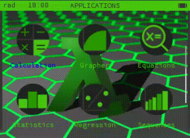  

For installation instructions, please refer to the [installation guide](#installation-guide)

# Clarifications
A userland differs from an OS because it is more restricted. The difference between Lambda and Upsilon or Omega is therefore that the latter two are operating systems.
A userland is not permanent after a reset. During a reset, the calculator reverts to Epsilon. This is not the case with a bootloader such as Upsilon or Omega.
- Epsilon is the official OS of Numworks.
- Lambda is a fork of Epsilon but nevertheless remains a userland.
- During a reset, lambda does not disappear, you just need to relaunch it using the launcher.
- The compatible Numworks calculators are `N0110`, `N0115`, and `N0120`. For `N0100`, it hasn't been tested, but permanent storage and runtime theme import should cause the calculator to crash.

---

# Table of Contents
- [Features](#functionalities)
- [Launcher](#launcher)
- [Clock](#clock)
- [Lambda App](#lambda-app)
- [Customization](#customization)
- [Shortcuts](#shortcuts)
- [Python](#python)
- [All wallpapers](#all-backgrounds)
- [Animations](#animation)
- [Permanent storage](#permanent-storage)
- [Tutorials](#tutorials)
- [Installation guide](#installation-guide)

---

# Presentation
## Functionalities
Lambda offers you several features :
- Themes integrated directly into the userland.

To change them you need to go into the [Lambda](#lambda-app) application.
Below are some examples :  
**Classic Lambda**  
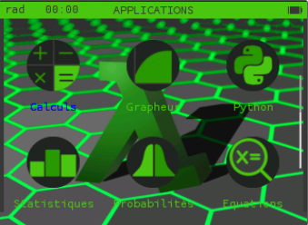  
**Lambda 2**  
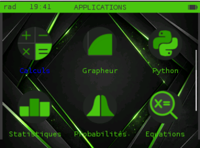  
**Town**  
This theme is animated. However, the animation remains basic, with lights flashing on the buildings.
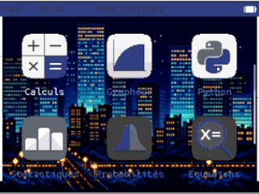  
**Epsilon**  
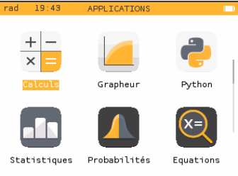  

- Other wallpapers are also included.

See [all wallpapers](#all-backgrounds).

- A Clock

This feature remains experimental. Indeed, when the calculator is turned off, it shuts down. Therefore, there is an `OFF` application to prevent this.

- Different types of icons

You can change it from the [Lambda](#lambda-app) application.
The icons are available in the most classic square format or in a round format which gives a more modern effect.  
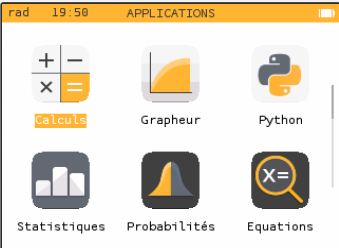  
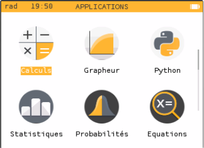  

- The ability to create and load your own theme at runtime.

For more information, see the [customisation](#customization) section.

- the ability to add a custom animation to the home screen.

An example of animation is this Minecraft creeper animation :  
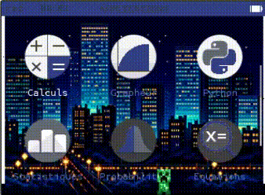  

This animation is available in the folder: `apps/animation/animations/creeper.bin`.

To create your own, see the [customisation](#customization) section.

- A permanent storage system to prevent data loss after a reset. This storage is also significantly larger than the official system.
For more information, see the [permanent storage](#permanent-storage) section.

## Launcher
The launcher is only useful for those using a calculator with the official Numworks bootloader. With a bootloader like Upsilon or Omega, the launcher will be useless and may even cause the device to crash.

The calculator `N0100` is not supported by userland.

The launcher allows you to fully utilize the userland. Without it, you won't be able to use runtime theme loading to its full potential, and the permanent file system will be unusable.

To install it, download it [here](https://raw.githubusercontent.com/100Sp4rk100/Lambda-OS/master/ressources/Lambda_OS.nwa) and install it from the [Numworks external apps installer](https://my.numworks.com/apps). You will need to be logged into your Numworks account to do this.

Finally, open it and press 1.

Before install the launcher, you need to follow the [installation guide](#installation-guide).

## Clock
You now have the time on your calculator.
This feature remains experimental. Indeed, when the calculator is turned off, it shuts down. Therefore, there is an `OFF` application to prevent this.

## Lambda App
This application contains all the settings related to the functionalities added by the Lambda userland.
You can set the clock and reset it. You can also change themes, icon visuals, and enable or disable animation on the home screen.

The main menu :  
  
The themes menu :  
  
The menu for selecting the theme :  
  
The clock menu :  
  

## Customization

### Dynamic Profile
You can create and load dynamic profiles from this [website](https://100sp4rk100.github.io/Lambda-Theme-Maker-WebSite/).

The loaded theme will then be called `profile.theme`. If you want to store several, rename it with another name ending in `.theme` and you will be able to activate it from the `Explorer` application.

You can import a `.theme` using [Lambda File Exchanger](https://100sp4rk100.github.io/Lambda-File-Exchanger/) or [Upsilon File Exchanger](https://yaya-cout.github.io/Numworks-connector/#/)

For more information on how to create a dynamic profile, refer to the [tutorials](#tutorials) section.

### Add a wallpaper
To add a background by recompiling the userland, you need to add your image in `PNG` format to this folder: `apps/theme_gestion/customs_backgrounds`.
Then, to use it with a dynamic profile, you will need to calculate its background number as follows: `position in the folder` + 4.
For example, for `apps/theme_gestion/customs_backgrounds/example.png`, which is in the first position in the folder, you need to enter `1+4=5`.

Note that you can still add a wallpaper using the dynamic profile without recompiling everything. This option is useful if you want several custom wallpapers.

## Shortcuts
Shortcuts are only available on the start screen.
There are two of them :
- `Toolbox` to open the `Lambda` application
- `Ans` to open the `settings`

## Python
Clock management has been added to the `time` module.
*To set time :*
```python
import time
time.setTime(15, 2, 59) # h, m, s
```

*To get time :*
```python
import time
time.getTime()
```

*To reset time :*
```python
import time
time.resetTime()
```

## All Backgrounds
To use it in a `dynamic profile` you have to put the number of the background. It works with integrated backgrounds and all the backgrounds you add.

- 1  
  

- 2  
  

- 3  
  

- 4  
  

- 5  
It's an image adding in forlder `apps/theme_gestion/customs_backgrounds`.  
  

## Animation
To select an animation, you need to go to the `Explorer` application and select a `.anim`.
To stop it, you need to go into the `Lambda` application.
You can import a `.anim` file using [Lambda File Exchanger](https://100sp4rk100.github.io/Lambda-File-Exchanger/) or [Upsilon File Exchanger](https://yaya-cout.github.io/Numworks-connector/#/)
For more information on creating a custom animation, see the [tutorials](#tutorials) section.

# Permanent Storage
Permanent storage management is in the `Explorer` application.
Within the application, there are two categories :
- So-called temporary files
- Internal files  

  

The temporary files correspond to the Epsilon base files.
Internal files are part of the Lambda system.
Formatting temporary or internal files will irreversibly delete all associated system files.

When you select a file, you get this interface :  

  

- The field containing the name allows you to rename the file
- The delete button will irreversibly delete the file
- The move button moves the file to the other file system. For example, if it's an internal file, it will be moved as a temporary file.
- The copy button copies the file to the other file system.
- The `Unavailable` button is only usable for `.theme` and `.anim` files. It will then activate the file and will be marked as `Activate`. For a `.theme` file, this will activate the file's theme, and for a `.anim` file, it will activate the animation on the home screen.

For internal files, you will find important information at the bottom :  
  
The green text indicates the space occupied by visible files. The red text indicates the space occupied by deleted files. To actually delete them, you must use Lambda File Exchanger.

---
# Tutorials
## Create a dynamic profile
You can create and load a dynamic theme with this [site](https://100sp4rk100.github.io/Lambda-Theme-Maker-WebSite/).

- In this first section, we will define the colors of the theme :  
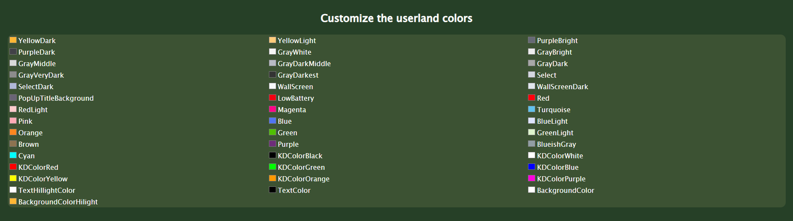  
For this step, it's up to you to test and experiment.
Note that some colors have a specific purpose:
- `TextHillightColor` which is used when you select an application from the home screen.
- `TextColor` which is the color of the application names from the home screen
- `BackgroundColor` which corresponds to the background colors on the home screen only if you do not activate the wallpaper or if exam mode is activated.
- `BackgroundColorHilight` which corresponds to the background color of selected text on the home screen only if you do not activate the wallpaper or if exam mode is activated.

- Next, there's a section to further customize the home screen :  
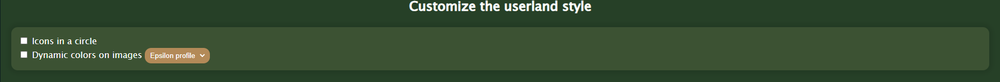  

Here, `Icons in a circle` changes the shape of the icons. If the box is checked, the icons will be circular; otherwise, they will be square. The square shape is the default shape for Epsilon.

If the `Dynamic colors on images` option is checked, the icons will adapt in color. This means that the yellow part of the Epsilon icons will be replaced by the color you defined in `YellowDark`.
If this option is not selected, you will be asked to choose an icon profile. You will have the choice between Epsilon icons or Lambda icons.

- In the next section, we will focus on the wallpaper :  
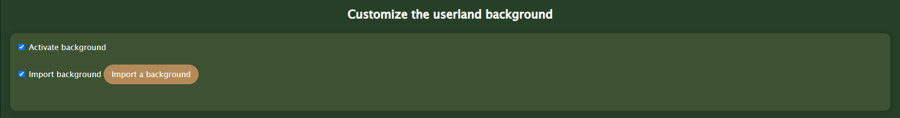  

You have the option to enable or disable the wallpaper.
If you activate it, you will have the choice between choosing a wallpaper integrated into the userland or importing one yourself.
If you do not import one, to get its number, refer to the section [all wallpapers](#all-backgrounds).
You can also add your own wallpapers during compilation, as explained in the "Add a wallpaper" section. This will allow you to add more than one.

- Finally, you will be able to change the icons to your own images :  
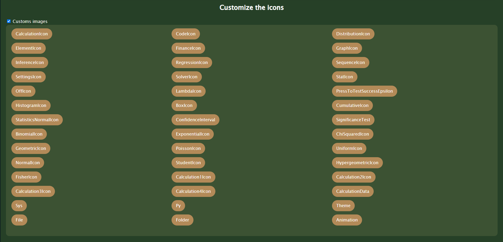  
You simply need to import your images, which will be automatically resized. You don't have to change all the icons. Those that remain unchanged will be those defined by the icon profile or by `Dynamic colors on images`.

To flash your theme, simply connect the calculator and click `Upload`. You also have the option to remove the calculator's theme.

If you want to share your theme with friends, click on `Download theme`, and then simply import it with `Import theme`.

**Tips:**
If you want to test a theme with a custom background or icons, first test the colors without the icons and background, as this will significantly speed up the theme download to the calculator. Once you've selected the desired colors, re-enable the icons and background.

## Create a custom animation
For this tutorial, you will need the files located in the `resources/Python` folder of the repository or in the `apps/animation/python` folder after compiling the userland. The second option will allow you to access the creeper animation example, which is significantly more complex than what we will cover here.

I suggest we create a simple cube that flashes in 2 colors.
To do this, you need to create a 16x16 image :  
  
I kept it simple, just a blue cube.
Now we need to convert this image into binary format. To do this, we will use the program `img2bin.py`.
To do this, we will run this command :

```sh
python img2bin.py base.png
```
We therefore obtain a file `base.bin`.

To check if this worked correctly, you can do the following:

```sh
python bin_viewer.py base.bin
```

Now we need to create a `JSON` file that will contain our animation.
The base file should look like this :
```json
{
    "base":"base.bin",
    "time":1000,
    "replacement_color":"0xFFFFFF",
    "position":[50, 208],
    "animation":[]
}
```
Here, in the `base` field, you need to define the path to our previously created binary image. In `time`, the animation's refresh rate in milliseconds. In `replacement_color`, the color that will be considered transparent. This won't be useful to us, but in the creeper example, it was `0xED1C24`. In the `position` field, we define the animation's position.
It is the `animation` field that will allow us to animate our cube.
We will now add our first frame to the animation. To do this, we will add the following to the `animation` list :
```json
{
    "comment": "Red",
    "pixels": [[8, 8], [9, 8], [8, 9], [9, 9]],
    "colors": ["0xED1C24", "0xED1C24", "0xED1C24", "0xED1C24"],
    "codes": []
}
```
The `comment` field is optional but allows for better readability.
Don't panic, I'll explain !
We defined the list of pixels that change in this frame. To do this, we entered their coordinates into the image.
In the `colors` field, we entered their new colors, which are `0xED1C24`. If we wanted them to become transparent, we would have entered `0xFFFFFF`.
At this frame, the image will therefore be :  
  

Don't panic when trying to compile the pixel list. If you have a large change, simply have the two frames as an image and use the `pixels_diff.py` script :

```sh
python pixels_diff.py frame_1.png frame_2.png
```

You will get the list of pixels and colors that changed between frame 1 and 2.

We just want to make the red dots blink, so we'll define the frame's action. To do this, we'll simply return to the initial state using `loop`.
So we get this :
```json
{
    "comment": "Red",
    "pixels": [[8, 8], [9, 8], [8, 9], [9, 9]],
    "colors": ["0xED1C24", "0xED1C24", "0xED1C24", "0xED1C24"],
    "codes": [["loop", []]]
}
```
We have added a code. Each code must have its own list of arguments (even if empty!).
Note that you must use an exit code for each frame. You can choose between `loop`, `next`, or `jump`.

Here are all the possible codes :
| Code | Arguments | Use |
|------|-----------|-------------|
| loop |[]| returns to the initial state by resetting the variables to 0 |
| move | [x, y] | moves the animation by x and y pixels |
| next | [] | move to the next frame |
| jump | [frame] | jumps to the given frame |
| add_0 | [value] | adds `value` to the variable 0 |
| add_1 | [value] | adds `value` to variable 1 |
| add_2 | [value] | adds `value` to variable 2 |
| add_3 | [value] | adds `value` to variable 3 |
| case | [variable/ value, operation, variable value] | performs the condition given between argument 0 and argument 2. There are 3 possible operations |
| set_0 | [value] | sets the variable 0 to `value` |
| set_1 | [value] | sets variable 1 to `value` |
| set_2 | [value] | sets variable 2 to `value` |
| set_3 | [value] | sets the variable 3 to `value` |

Possible operations :
| Operation | Explanation |
|------------|--------------|
| "lower" | Corresponds to < |
| "higher" | Corresponds to > |
| "equal" | Corresponds to = |

In the case of a `case`, you can enter either a numeric value or a variable. To specify a variable, use the following :
| Variable |
|----------|
|var_0|
|var_1|
|var_2|
|var_3|

The `case` statement executes the first code after it if the result is true, and the second if it is false. Therefore, it is necessary to place two actions after a `case` statement.

Now that you know the codes, let's do something more complex.
We will make our cube blink red 4 times then green 4 times before returning to red.
We will therefore create a second frame with the pixel change highlighted in green :
```json
{
    "comment": "Green",
    "pixels": [[8, 8], [9, 8], [8, 9], [9, 9]],
    "colors": ["0x00FF00", "0x00FF00", "0x00FF00", "0x00FF00"],
    "codes": []
}
```

This gives us the following code :
```json
{
    "base":"base.bin",
    "time":1000,
    "replacement_color":"0xFFFFFF",
    "position":[50, 208],
    "animation":[
        {
            "comment": "Red",
            "pixels": [[8, 8], [9, 8], [8, 9], [9, 9]],
            "colors": ["0xED1C24", "0xED1C24", "0xED1C24", "0xED1C24"],
            "codes": []
        },
        {
            "comment": "Green",
            "pixels": [[8, 8], [9, 8], [8, 9], [9, 9]],
            "colors": ["0x00FF00", "0x00FF00", "0x00FF00", "0x00FF00"],
            "codes": []
        }
    ]
}
```

Let's move on to the programming.
To make the red pixel blink 4 times, we will use a variable :
```json
{
    "comment": "Red",
    "pixels": [[8, 8], [9, 8], [8, 9], [9, 9]],
    "colors": ["0xED1C24", "0xED1C24", "0xED1C24", "0xED1C24"],
    "codes": [
        ["add_0", [1]],
        ["case", ["var_0", "lower", 4]],
        ["jump", [0]],
        ["next", []]
    ]
}
```
Here, we start by incrementing the variable 0 by 1, then we check if it is less than 4. If so, we jump to frame 0, that is, the same frame, otherwise we move on to the next one.

Let's code the following frame :
```json
{
    "comment": "Green",
    "pixels": [[8, 8], [9, 8], [8, 9], [9, 9]],
    "colors": ["0x00FF00", "0x00FF00", "0x00FF00", "0x00FF00"],
    "codes": [
        ["add_1", [1]],
        ["case", ["var_1", "lower", 4]],
        ["jump", [1]],
        ["loop", []]
    ]
}
```
We repeat the same pattern but with variable 1. When changing frames, we use `loop` to return to the initial state by resetting the variables.

The final code is therefore :
```json
{
    "base":"base.bin",
    "time":1000,
    "replacement_color":"0xFFFFFF",
    "position":[50, 208],
    "animation":[
        {
            "comment": "Red",
            "pixels": [[8, 8], [9, 8], [8, 9], [9, 9]],
            "colors": ["0xED1C24", "0xED1C24", "0xED1C24", "0xED1C24"],
            "codes": [
                ["add_0", [1]],
                ["case", ["var_0", "lower", 4]],
                ["jump", [0]],
                ["next", []]
            ]
        },
        {
            "comment": "Green",
            "pixels": [[8, 8], [9, 8], [8, 9], [9, 9]],
            "colors": ["0x00FF00", "0x00FF00", "0x00FF00", "0x00FF00"],
            "codes": [
                ["add_1", [1]],
                ["case", ["var_1", "lower", 4]],
                ["jump", [1]],
                ["loop", []]
            ]
        }
    ]
}
```

Now, let's compile the animation. To do this, we'll run this command :
```sh
python make_animation.py animation.json
```
We will obtain a file named `animation.bin`.

To view the animation without flashing it on the calculator, you can run this command :
```sh
python animation_viewer.py animation.bin
```

And there you have it, all you have to do now is flash your animation with [Lambda File Exchanger](https://100sp4rk100.github.io/Lambda-File-Exchanger/) or [Upsilon File Exchanger](https://yaya-cout.github.io/Numworks-connector/#/). If you want to have the animation on calculator, rename it to `animation.anim`.

## Using Lambda File Exchanger
Lambda File Exchanger allows you to manage your files in permanent and temporary storage.
As a reminder, so-called external files are not permanent to the rest, unlike internal files.
When connecting the calculator, loading internal files takes time; please wait until this loading is complete before performing any operation.

Managing external storage is quite simple :  
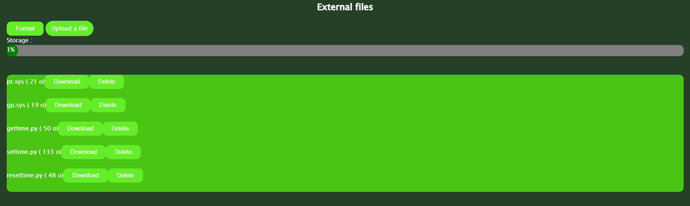  
You can add, delete, and upload a file.
You also have the option to format the storage, which will delete all files.

Let's now look at internal storage management :  
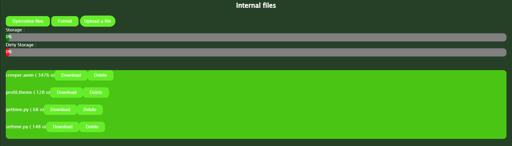  
The green bar indicates the space occupied by visible files. The red bar indicates the space occupied by deleted files.
You can also format the storage and download the files.
When you delete or import a file, to synchronize it with the calculator, you must click on `Synchronize files`. Since this operation takes time, it is advisable to make all the desired changes before clicking.

---

# Installation Guide
To obtain the lambda userland code, you need to get the official Numworks code. To do this, run these commands in a terminal :
```sh
git clone https://github.com/numworks/epsilon.git
cd epsilon
git checkout version-23
```
Next you need to download the patch file: <a href="https://raw.githubusercontent.com/100Sp4rk100/Lambda-OS/master/ressources/epsilon-v23.patch" download>epsilon-v23.patch</a>, in the `ressources/epsilon-v23.patch` folder or from the `release` section.

Move it to the `epsilon` folder and run the command :
```sh
git apply epsilon-v23.patch
```

It is important to change the target version in the `build/config.mak` file.
To do this, turn on your calculator and go to Settings, then `About`, and note the `Software version`. Finally, in the `build/config.mak` file, replace `EPSILON_VERSION` with the one you found earlier.

Now we need to compile the userland. To do this, run these commands :  
*For the calculator :*
```sh
make clean
make -j16 MODEL=your_model userland.B.dfu
python3 build/device/dfu.py -s 0x90410000:leave -D output/release/device/your_model/userland/userland.B.dfu
```

*For the simulator :*
```sh
make PLATFORM=simulator clean
make -j16 PLATFORM=simulator epsilon_run
```

Next, for the calculator only, go to settings and reset it. Then use the launcher to relaunch userland.
